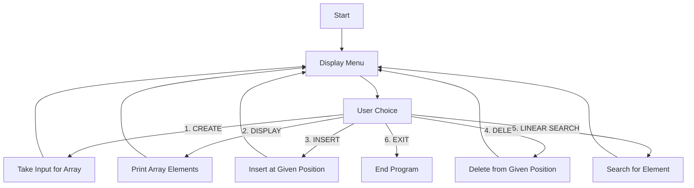

# 🖥️ Data Structures – Lab Assignment 1 (Arrays)

Welcome to my **C++ Data Structures Lab Assignment 1** repository!  
This project contains multiple programs demonstrating **basic array operations** and related algorithms for UCS301 – Data Structures. 🚀

---

## 📜 **Assignment Overview**
This assignment includes:

1️⃣ **Menu-driven Array Operations**  
   - Create  
   - Display  
   - Insert  
   - Delete  
   - Linear Search  
   - Exit  

2️⃣ **Remove Duplicates** – Keep only unique elements in an array.  

3️⃣ **Predict Output** – Understanding array initialization.  

4️⃣ **Matrix Operations**  
   - Reverse an array (extra array method)  
   - Matrix multiplication  
   - Matrix transpose  

5️⃣ **Sum of Rows & Columns** – For a 2D array.  

6️⃣ **Binary Search** – Fast search algorithm in O(log n) time.  

---

## 🛠 **Tech Used**
- Language: **C++**
- Concepts: Arrays, 2D Arrays, Loops, Functions, Search Algorithms

---

## 📊 **Program Flow – Menu Driven Arrays**


---

## 📂 **Folder Structure**
```
Lab_Assignment_1/
│-- menu_array.cpp
│-- remove_duplicates.cpp
│-- reverse_array_matrix.cpp
│-- sum_rows_columns.cpp
│-- binary_search.cpp
│-- README.md
```

---

## 🧠 **Example Output – Remove Duplicates**
```
Enter number of elements: 6
Enter elements: 1 2 2 3 4 4

Array after removing duplicates:
1 2 3 4
```

---

## 🚀 **How to Run**
```bash
g++ filename.cpp -o program
./program
```

---

## 📌 **Notes**
- For binary search, the array **must be sorted**.
- Matrix multiplication only works if **columns of first = rows of second**.

---

## ✨ Author
**Aryan** – Computer Science Student 💻  
📚 Learning Data Structures & Algorithms  
